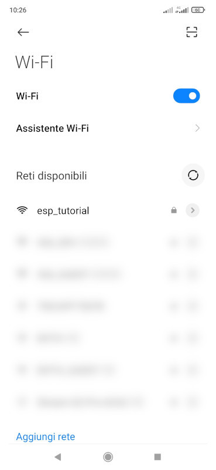

# HTTP Server Tutorial
<div style="text-align:justify">

## Introdution

In this tutorial you will create a simple http server as a mean for provisioning. The esp32* module will start as an access point (AP) and serve a simple http page which lets the user to connecto to it, browse to a specific page and enter the SSID and password of the router. 
The SSID and password are then read and showed on the terminal. In a real application, you would stop the AP and use these credentials to connect as a station (STA) to the user's router. 

### What you will learn

Through this activity, you will learn how to start the ESP32* as an AP and how to manage HTTP request. To do so, you will learn how to create an event loop and which http events are available on the esp-idf framework. You will create a GET response sending a basic HTML page and read the data from a POST request. 

## Outline

The tutorial will have the following parts:
1. Create new project (test hello world)
2. Start ESP32* as AP
   * AP vs STA
   * SSID and PASSWORD
   * Connect to ESP32* AP
3. Create an event loop
   * What is an event loop?
   * What events are available?
4. Routes
   * What is a route?
   * Let's create a GET route
   * Let's create a POST route
   * How to use data?
5. Simple provisioning
   * Putting all together


__Prerequisites__

* Vscode installed and working (you can compile and run hello_world on a evk)
* An Espressif EVK or board you can flash code on
* You know the difference between Access point and Station
* You know the basic of HTTP (what a GET and POST request are)
* You know the basic of HTML (a few simple tags)

## Create a new project

To start a new project and be ready for the next steps you need to perform the following:
1. Create a new project from `hello_world` template
2. Set the target core 
3. Set the right port
4. Build, flash and start a monitor with `hello_world`

To start, let's create a new project. Open vscode, pess `CTRL+SHIFT+p`and start typing `ESP-IDF: New Project`. Follow the instruction to create a new project using the `hello_world`template. 

Then you have you set the target and the port for the flashing stage. In this tutorial we're using an `ESP32-C3-DevKitM-1`. 
Start typing `ESP-IDF: Set Espressif Device Target` and select `esp32c3`. If you are using and evk or a USB-UART bridge, you can select `The ESP32-C3 Chip via builtin USB-JTAG`. If you're using on of the `ESP-PROG` programmer, you can chose the best option accordingly. 

Select the right port, typing `ESP-IDF: Select Port to Use (COM, tty, usbserial)`. 
At this point, you can run the command `ESP-IDF: Build, Flash and start a Monitor on your device`. 

If everything runs smoothly, you should see the compilation finish succesfully, the flashing of the firmware and the `hello_world` example running, saying `Hello world!` and restarting after 10 seconds. 

Now change the content of `hello_world_main.c` to the following code

```C
#include <stdio.h>
#include <inttypes.h>
#include "sdkconfig.h"
#include "freertos/FreeRTOS.h"
#include "freertos/task.h"
#include <string.h>
// #include "esp_wifi.h"


void app_main(void)
{
    printf("Hello tutorial!\n");

}
```

Build, flash and monitor again to be sure that everything is working. 

Before moving on, it's best to change the file name. To do so, rename the file `hello_world_main.c` to `basic_http_server.c`. Then we have to inform CMake that it needs to compile this file instead of `hello_world_main.c`. Open `main/CMakeLists.txt` and change the content to
```
idf_component_register(SRCS "basic_http_server.c"
                    PRIV_REQUIRES spi_flash
                    INCLUDE_DIRS "")
```

Perform a full clean (`ESP-IDF: Full Clean Project`) and build, flash and open a monitor again. 


## ESP32* as AP


### (TO-CHECK - NVS)

First we inizialize the nvs flash. To do so we need to include "nvs_flash.h". To tell the compiler where to find it, we should add it as PRIV_REQUIRES in the CMakeLists.txt:
```
PRIV_REQUIRES nvs_flash
```

Remember to perform a full-clean every time you change the CMakeLists.txt file. 

### LOGS


To make it easier to test all the parts of the code, it's better to make use of the logging utilities given by the `esp_log.h` header. To do so, you need to include it at the beginning of the file. 
You can create a tag string, used for logging purposes with `static const char *TAG = "Basic HTTP Server";` and call the logginf functions as `ESP_LOGI(TAG, "ESP Tutorial");`.
You can find an in-depth explaination of all the loggin function [here](https://docs.espressif.com/projects/esp-idf/en/stable/esp32/api-reference/system/log.html).
In this tutorial only `ESP_LOGI` will be used. 


### Start IP Stack

Espressif IP stack is managed through an unified interface called [`esp_netif`](https://docs.espressif.com/projects/esp-idf/en/stable/esp32/api-reference/network/esp_netif.html#esp-netif). This interface was implemented to have an agnostic interface for every ip stack. For the time being the only TCP/IP stack available through this interface is lwIP. 

For the majority of application, it is enough to create a default network with the default event loop, and that is done in this tutorial. 

Now create a new function `wifi_init_softap` to keep things clean and to have a way to easily start a new task. 

What you need to do is
1. Initialize the `esp_netif` (`esp_netif_init`)
2. Initialize the standard event loop (`esp_event_loop_create_default`)
3. Initialize and register all handler for a soft ap application
4. Configure and start the wifi ap 

For a complete implementation with error handling you can refer [here](https://github.com/espressif/esp-idf/blob/master/examples/wifi/getting_started/softAP/main/softap_example_main.c#L47).

In the code the configuration is accessed through constants, so you need first to define all the required values for the inizialization (SSID, password, WiFi Channel and Maximum number of connections)

```c
#define ESP_WIFI_SSID "esp_tutorial"
#define ESP_WIFI_PASS "test_esp"
#define ESP_WIFI_CHANNEL 1
#define MAX_STA_CONN 2
```

Espressif's Wifi component makes use of [event loops](https://en.wikipedia.org/wiki/Event_loop). So you need to start the [default event loop](https://docs.espressif.com/projects/esp-idf/en/latest/esp32/api-reference/system/esp_event.html#default-event-loop) and create and register a function to handle the events. For now, this function will only print the `event_id`.

```c
void wifi_init_softap()
{
    esp_netif_init();
    esp_event_loop_create_default();
    esp_netif_create_default_wifi_ap();

    wifi_init_config_t cfg = WIFI_INIT_CONFIG_DEFAULT(); // always start with this

    esp_wifi_init(&cfg);

    esp_event_handler_instance_register(WIFI_EVENT,
                                                        ESP_EVENT_ANY_ID,
                                                        &wifi_event_handler,
                                                        NULL,
                                                        NULL);

    wifi_config_t wifi_config = {
        .ap = {
            .ssid = ESP_WIFI_SSID,
            .ssid_len = strlen(ESP_WIFI_SSID),
            .channel = ESP_WIFI_CHANNEL,
            .password = ESP_WIFI_PASS,
            .max_connection = MAX_STA_CONN,
            .authmode = WIFI_AUTH_WPA2_PSK,
            .pmf_cfg = {
                .required = true,
            },
        },
    };


    esp_wifi_set_mode(WIFI_MODE_AP);
    esp_wifi_set_config(WIFI_IF_AP, &wifi_config);
    esp_wifi_start();

    ESP_LOGI(TAG, "wifi_init_softap finished. SSID:%s password:%s channel:%d",
             ESP_WIFI_SSID, ESP_WIFI_PASS, ESP_WIFI_CHANNEL);
}
```

The function handling the events is for now simply

```c
static void wifi_event_handler(void* arg, esp_event_base_t event_base,
                                  int32_t event_id, void* event_data){
    printf("Event nr: %ld!\n", event_id);
}
```

Now compile, flash, start a monitor and run and you should start seeing a few event number appearing on the terminal.

At this point, you can take your smartphone, open the wifi list and select the ssid `esp_tutorial`. When you do so, you should see on the terminal `Event nr: 14!`. 

<!--  -->


If you check on the `esp-idf` code relative to the event codes ([here](https://github.com/espressif/esp-idf/blob/c5865270b50529cd32353f588d8a917d89f3dba4/components/esp_wifi/include/esp_wifi_types_generic.h#L964)), you can see that it refers to `WIFI_EVENT_AP_STACONNECTED`. 

> [!INFO] 
> You can use the `event_id`to discriminate between different events and then use the additional data you are provided with `event_data`.  


>[!NOTE] 
>  `event_data` is a void pointer, you need to cast it to the proper structure if you want to extract data. [Here](https://github.com/espressif/esp-idf/blob/c5865270b50529cd32353f588d8a917d89f3dba4/examples/wifi/getting_started/softAP/main/softap_example_main.c#L36) you can find two examples.

Now it's time to start the webserver. 

## Starting the webserver

Http servers are managed through the [`http_handle_t`](https://docs.espressif.com/projects/esp-idf/en/stable/esp32/api-reference/protocols/esp_http_server.html#_CPPv414httpd_handle_t) structure. This means that all function related to webserver will need the `http_handle_t` as first argument. 

>[!NOTE] If you're new to object oriented programming with c, you can check 
 [this](https://www.codementor.io/@michaelsafyan/object-oriented-programming-in-c-du1081gw2) and [this](https://home.cs.colorado.edu/~kena/classes/5448/f12/presentation-materials/gatchell.pdf) resources

To keep things clean, it's better to create a separate function `start_webserverreturning a `http_handle_t` object. But first, you need to include the appropriate library `#include esp_http_server.h`. 

>[!NOTE]
>As done before, you need to include `esp_http_server` in your PRIV_REQUIRES. Remember also to do a full clean before compiling again, as you should always do when the CMakeLists.txt is modified. 

```c
static httpd_handle_t server = NULL 
server = start_webserver();
```

and start writing the `start_webserver()` function. 

As with the AP, it is suggested to get the standard configuration with a specific function and modify afterwards the configuration items you want to change. 
The configuration is stored in the `httpd_config_t` structure and the default configuration is given by `HTTPD_DEFAULT_CONFIG()`.

```c
httpd_config_t config = HTTPD_DEFAULT_CONFIG();
```

after that you can start the server with the `httpd_start` function to which you need to pass the handler you created before. This function returns an `esp_err_t` structure, which you can use to check if the function had errors while running. 
If you build, flash and run a monitor, you should now see the following warning.
```
W (39634) httpd_uri: httpd_uri: URI '/' not found
W (39634) httpd_txrx: httpd_resp_send_err: 404 Not Found - Nothing matches the given URI
```
It's time to register the URI handlers.

### URI Handlers

URI (Uniform Resource identifier) are managed through `httpd_uri_t`. In this example we will only manage a single GET URI at root address `/`. 
```c
static const httpd_uri_t hello_world = {
    .uri       = "/",
    .method    = HTTP_GET,
    .handler   = hello_get_handler,
    .user_ctx  = NULL
};
```

In this structure you need to pass the resource address (in this case the root), the typology or request, a handler callback function and optional user context data. 

As you may guess, among the available methods values you can find `HTTP_GET` `HTTP_POST` `HTTP_PUT`. You can find the full list [here](https://github.com/espressif/esp-idf/blob/0d6099ec533c4b647fb7a7b0b8942bc7aeb82f90/components/http_parser/http_parser.h#L94) (the enum is created througth a macro). 

To process the request, you need to write the handler function, which has the following signature `static esp_err_t handler_name(httpd_req_t \*)` and call `httpd_resp_send`. In this tutorial, a simple HTML response is sent back to the user

```c
/* An HTTP GET handler */
static esp_err_t hello_get_handler(httpd_req_t *req)
{
    const char* resp_str = "<h1>Hello World</h1>";
    httpd_resp_send(req, resp_str, HTTPD_RESP_USE_STRLEN);
    return ESP_OK;

}
```
